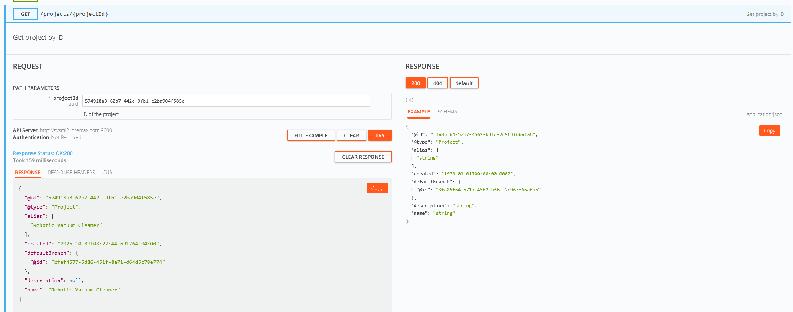
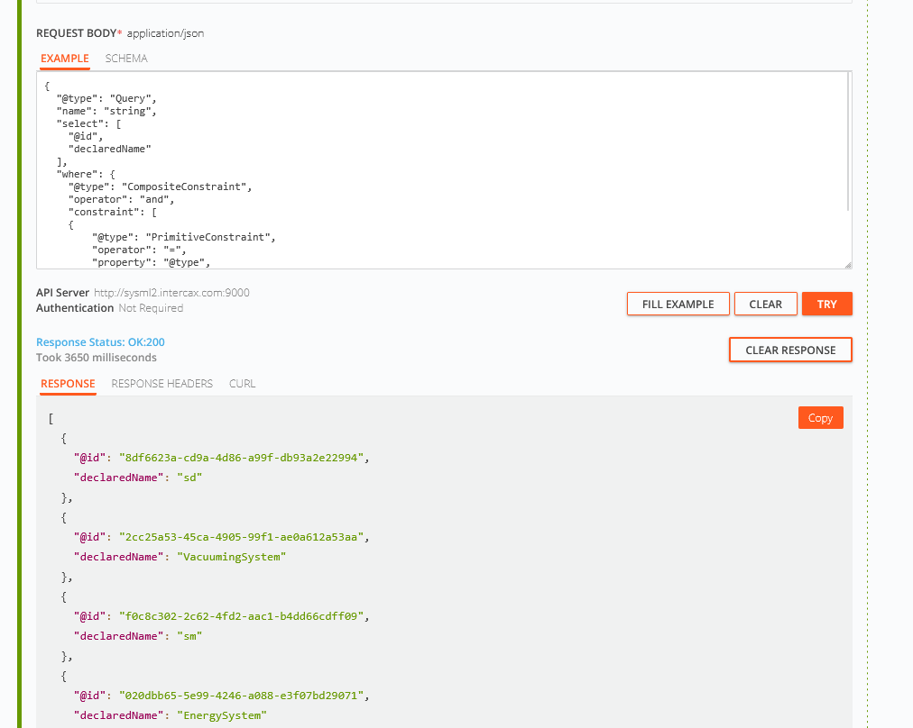

# SysML v2 API Usage Documentation


## Publishing models

The API has an integrated Model Server that structures the SysML v2 model in conformance with the specification.
Each element (including relationships) gets a unique ID and is structured with respective relations.

To achieve this, models have to be published to the server.
Here, dedicated jupyter kernels exist, which can be installed with conda: https://www.npmjs.com/package/@systems-modeling/jupyterlab-sysml (current version: 0.52.1)

Some jupyter lab environments already include this kernel such as [Sysmlv2Lab](https://www.sysmlv2lab.com) (thanks to @Weilkiti for hosting).
This will used as an example for the interaction.

Open the platform and create a new SysML v2 Notebook (orange button).


Copy the content of [integration.sysml](https://github.com/GfSE/MBSE_AG_vacuum-cleaner-robot-example/blob/f5a84d3f6d2aa9acf7e1061789404ea41492a850/Functions/Integration/Integration.sysml) into the Cell:

> [!CAUTION]
> As the current ``master`` branch has several issues in the Integration file an old commit is used. 
> Please check that you are using the correct file.


Press ``Ctrl+Enter`` to start the compilation.

This will create the packages mentioned in the Integration and give them a unique ID:


You can vizualize them by using the ``%viz`` command in a new cell (press the + button on top).
You have to reference the name with name with ticks to show that it is one name.
Components within a package can be addressed by using the ``::`` notation in breaking them down.


To publish it use ``%publish "Robotic Vacuum Cleaner"`` or any other of the packages.
This will then be pushed to the configured API server (in case of [Sysmlv2Lab](https://www.sysmlv2lab.com) to [intercax](http://sysml2.intercax.com:9000/docs/).)


> [!NOTE]
> Both the SysML v2 Lab and the Intercax Server are regularly purged as they are only intended for testing.
 > Once this is done a new id will be created - always check your ID!

## Looking up models

The consuming will be shown in Swagger.
The Intercax Implementation (http://sysml2.intercax.com:9000/docs/) is used as an example.

When you want to use a function, open the drop down and insert the required variables into the input fields.

The most important ID is the project id - you need it in every call you do:

| Name | From | Example |
|------|------|---------|
| ``Project id`` | Publishing command | ``574918a3-62b7-442c-9fb1-e2ba904f585e`` |
| ``branch id`` | Publishing command | ``bfaf4577-5d86-451f-8a71-d64d5c78e774`` |
| ``Commit id`` | Publishing command | ``4ec9b97c-ca51-4def-b764-4a5111e63b70`` |


You can verify them with ``GET /projects/{projectId}`` and ``GET /projects/{projectId}/commits``



To get see all existing elements use ``GET /projects/{projectId}/commits/{commitId}/elements``

If you want a specific part it is better to use queries.
The [SysML v2 API Cookbook](https://github.com/Systems-Modeling/SysML-v2-API-Cookbook/blob/main/Queries.ipynb) shows how to do them.

In our example, you can use the following in ``POST
/projects/{projectId}/query-results``

```json
{
  "@type": "Query",
  "name": "string",
  "select": [
    "@id", 
    "declaredName"
  ],
  "where": {
    "@type": "CompositeConstraint",
    "operator": "and",
    "constraint": [
    {
        "@type": "PrimitiveConstraint",
        "operator": "=",
        "property": "@type",
        "value": ["PartUsage"]
    }]
  }
}
```



Select the element you would like to inspect and check the other functions as well.
