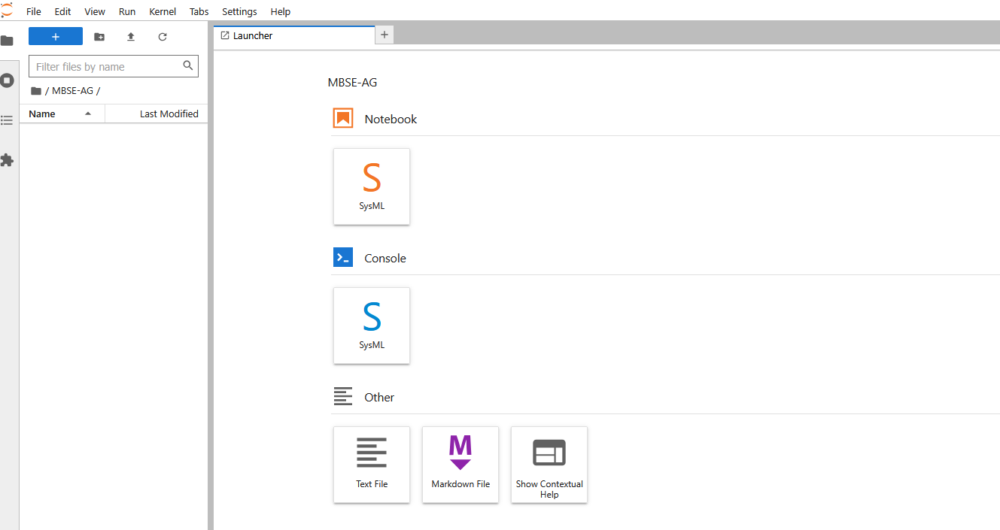
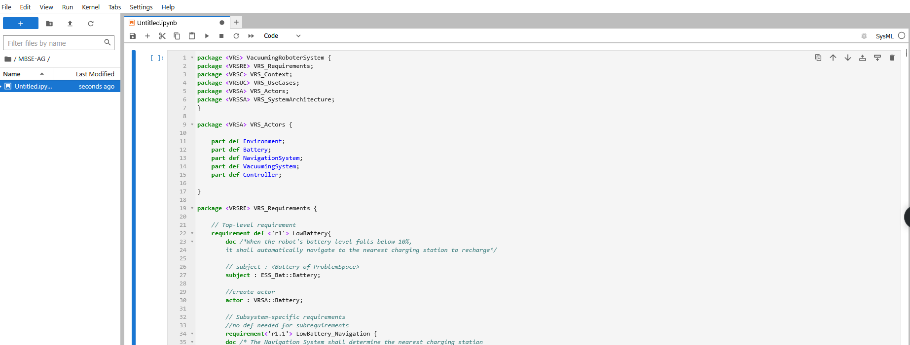

# SysML v2 API Usage Documentation

## Publishing models

The API has an integrated Model Server that structures the SysML v2 model in conformance with the specification.
Each element (including relationships) gets a unique ID and is structured with respective relations.

To achieve this, models have to be published to the server.
Here, dedicated jupyter kernels exist, which can be installed with conda: https://www.npmjs.com/package/@systems-modeling/jupyterlab-sysml (current version: 0.52.1)

Some jupyter lab environments already include this kernel such as [Sysmlv2Lab](https://www.sysmlv2lab.com) (thanks to @Weilkiti for hosting).
This will used as an example for the interaction.

Open the platform and create a new SysML v2 Notebook (orange button).

Copy the content of [integration.sysml](../../Functions/Integration/Integration.sysml) into the Cell:

Press ``Ctrl+Enter`` to start the compilation.

## Looking up models

In the following the