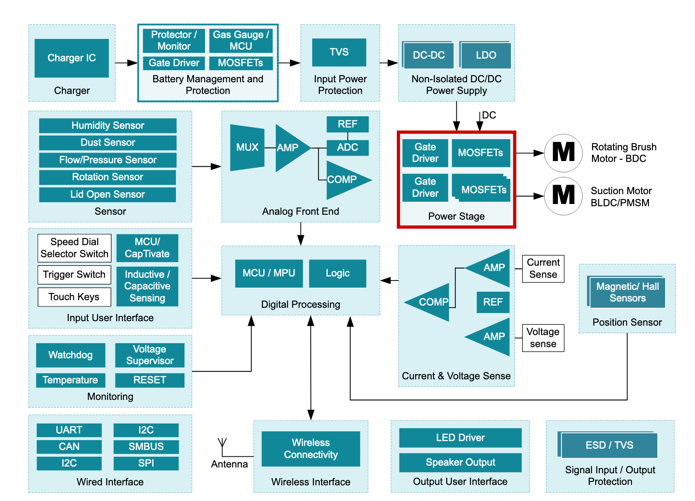

# Generelle Informationen
- Komponentendiagramm (i.W.S.) von T.I.: https://www.ti.com/solution/cordless-vacuum-cleaner
- Paper Development of a vacuum cleaner robot https://www.sciencedirect.com/science/article/pii/S1110016818300899
- etwas ältere Dissertation zur Entwicklung kooperierender Roboter (mit Fokus auf das konstruktive Design und den Steruungsentwurf): https://www.db-thueringen.de/servlets/MCRFileNodeServlet/dbt_derivate_00019692/ilm1-2010100068.pdf

# Abbildungen
Transparentansicht ([Quelle](https://domotique.jeanlepine.com/index.php?post/2017/06/24/Course-d-aspirateurs))

Beispielhafte Bodenansicht ([Quelle](https://de.roborock.com/pages/roborock-s5-max))

BeispielZubehör

Beispiel Architektur

